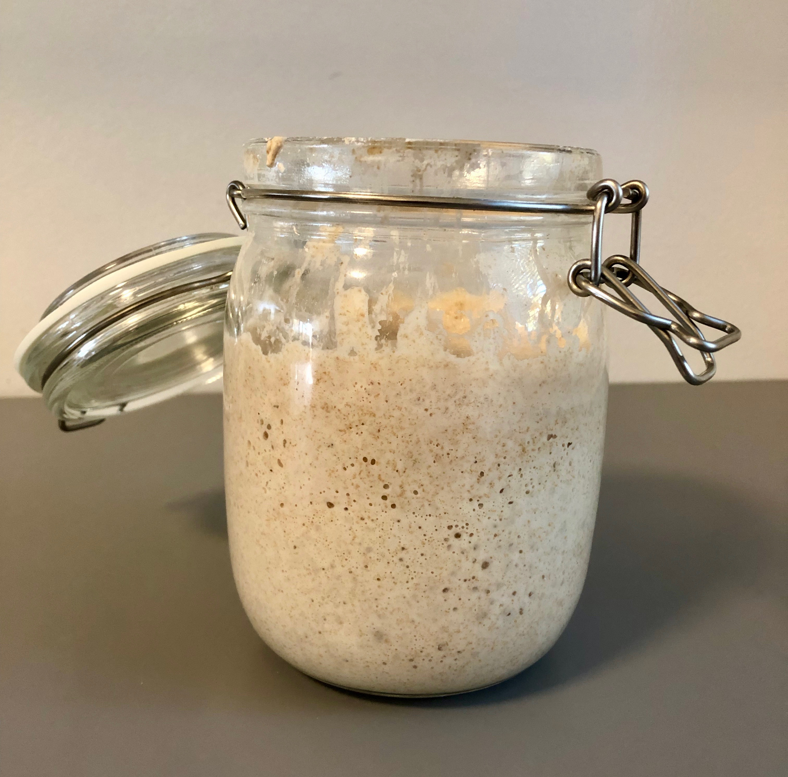
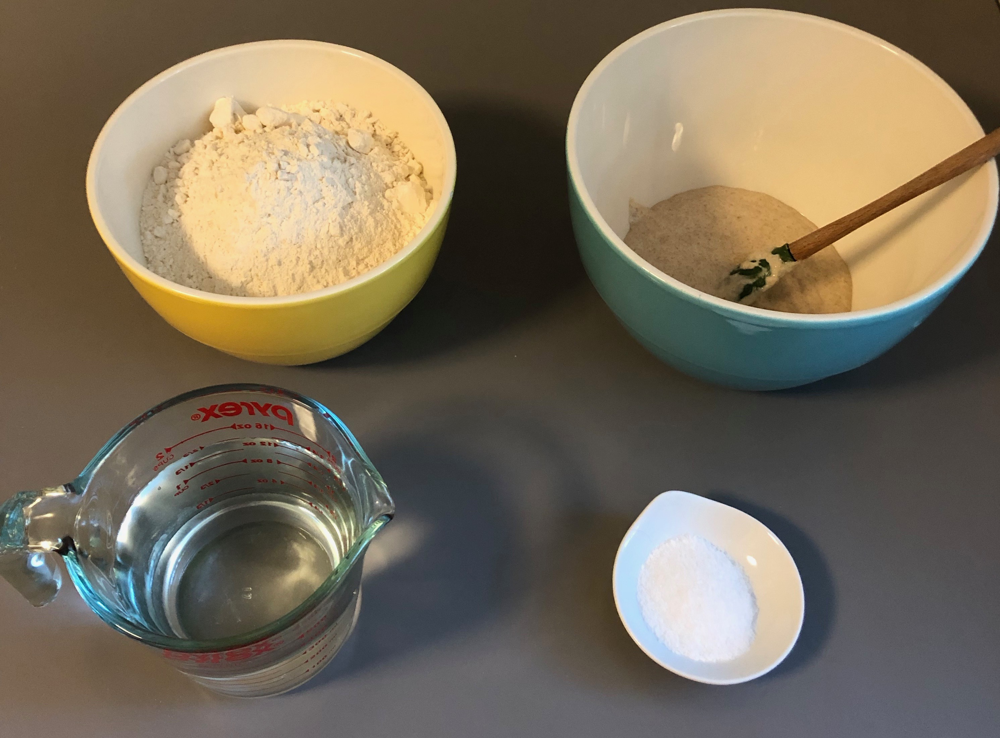
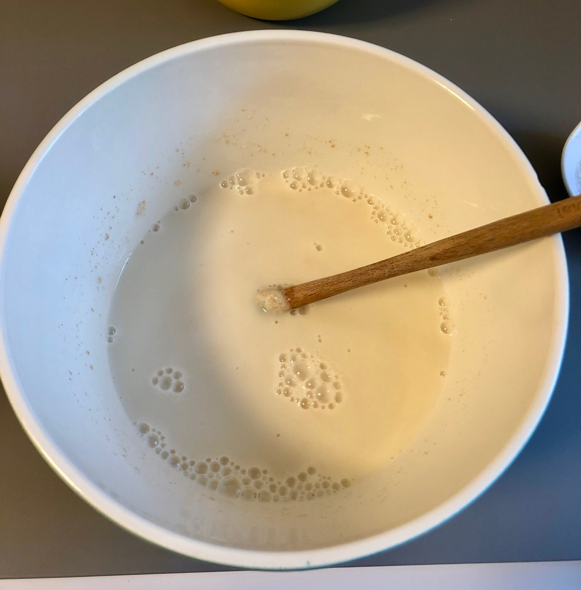
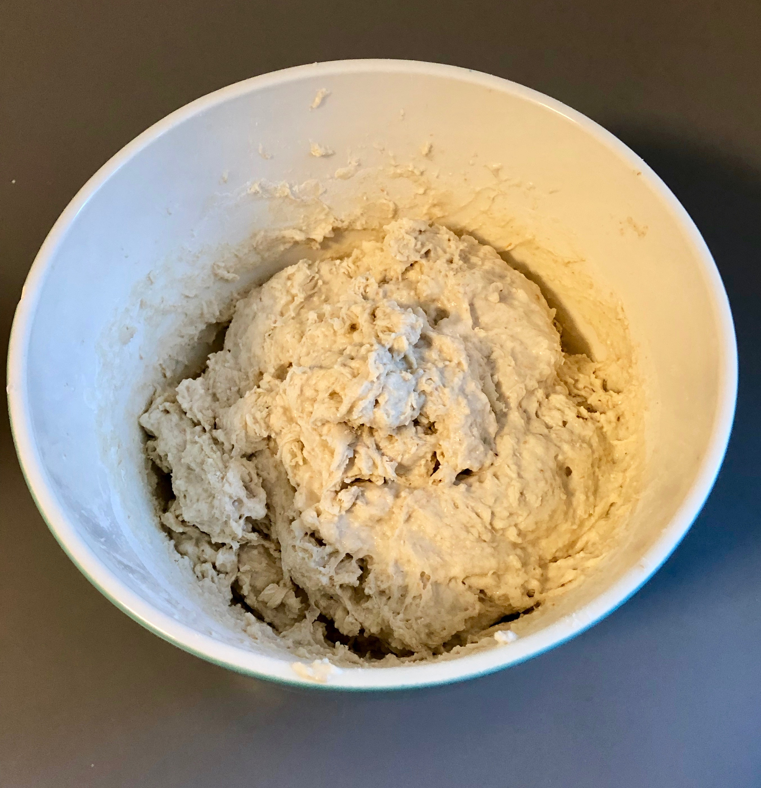
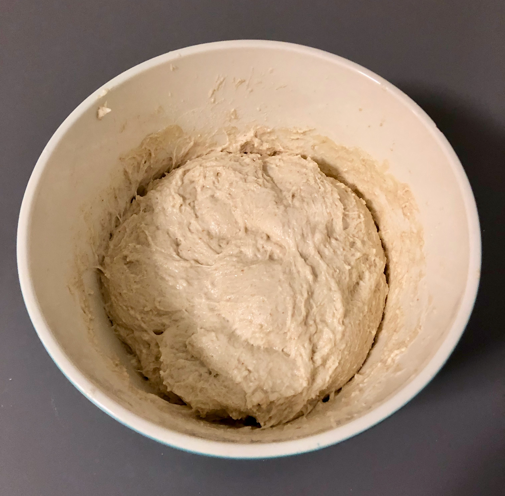
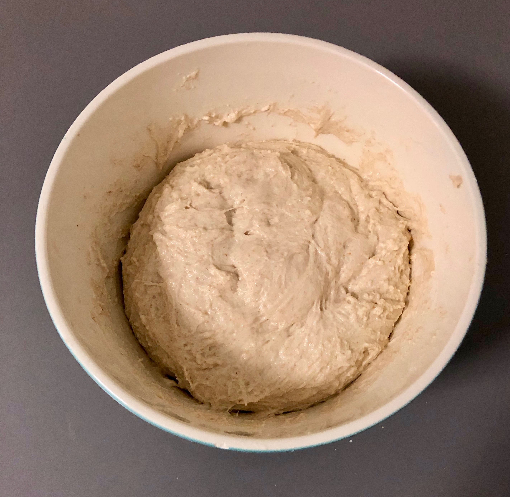
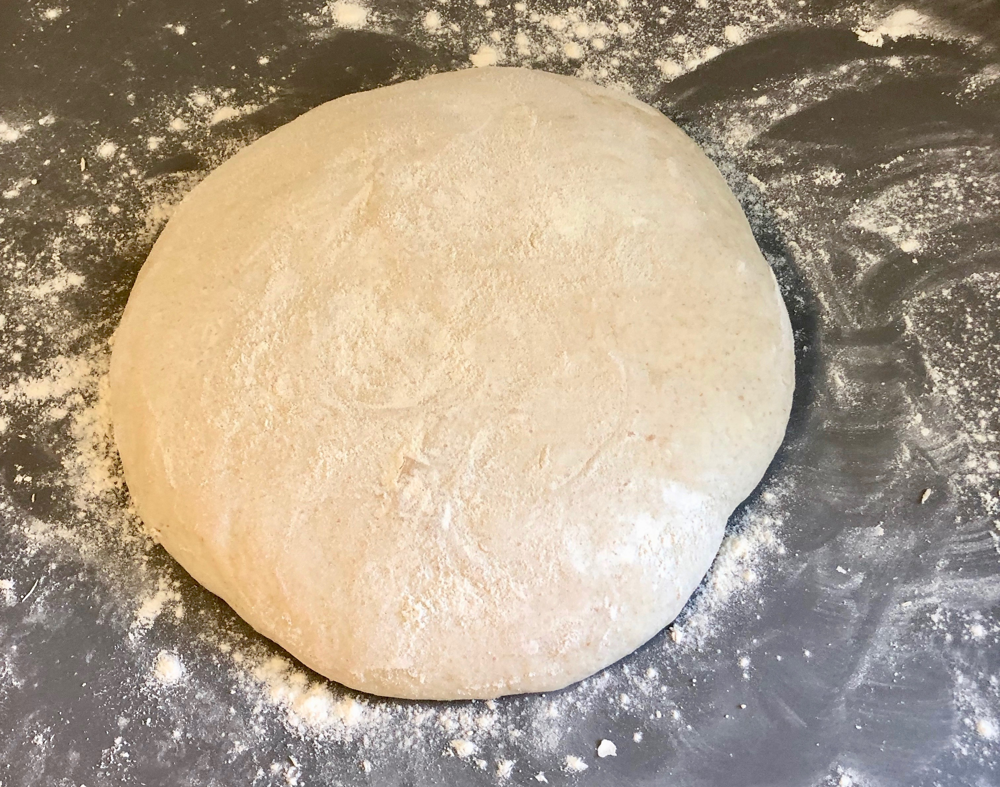
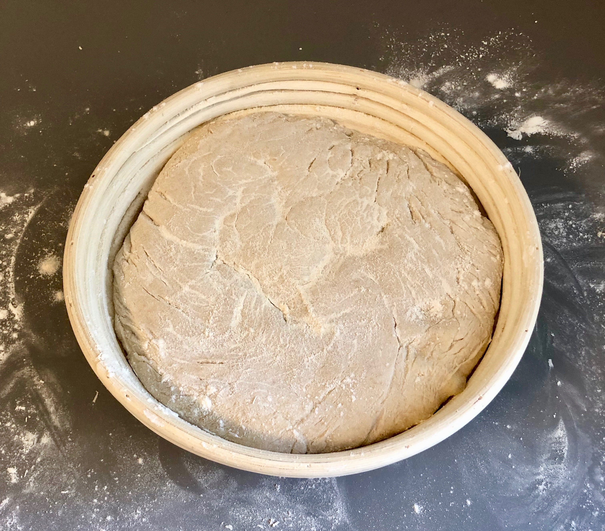
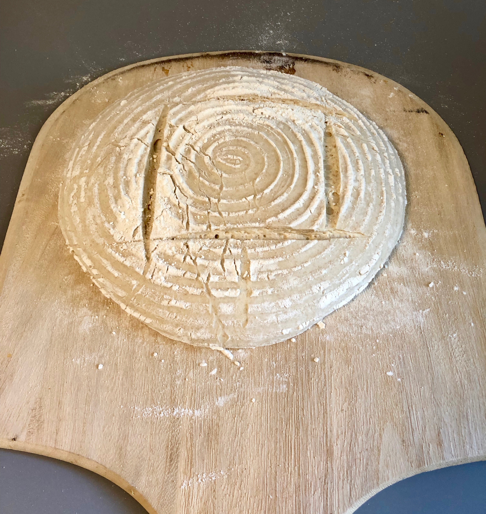
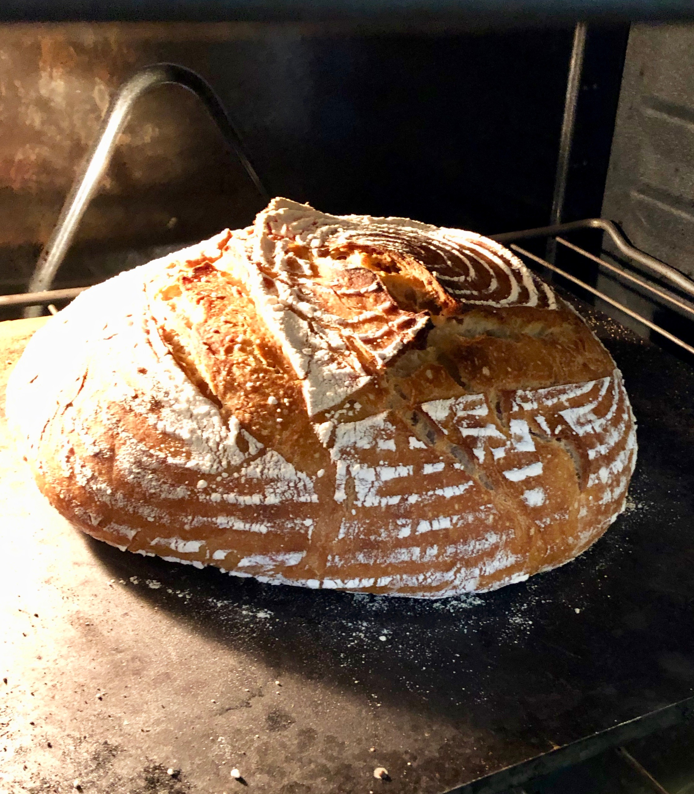

This post is intended to walk a new baker through making their first loaf of sourdough, using our [Basic Sourdough](recipes/basic-sourdough) recipe. Hopefully, after reading through this post, you will be confident to bake your own sourdough, using this recipe, as well as others, as the technique will be largely the same. Every baker should make [Tartine Bread](https://cooking.nytimes.com/recipes/1016277-tartines-country-bread) at least once. It has a much more involved process, including making an overnight leaven,, but the techniques of turning the load periodically, shaping, and baking are similar. 

## Making The Dough

The first step is to ensure that you have a healthy and active starter. In an [earlier post](maintaining-a-sourdough-starter), I talked about how to maintain a starter, so review that if you aren't confident of your starter, review that post. When making this recipe, it is important to make sure your sourdough is at a high activity level, so be sure to feed it 3-6 hours before assembling your dough. Once your starter is ready, it should be full of bubbles and have risen significantly.

At this point you are ready to make your dough. Begin by assembling the ingredients. 
- 200 grams sourdough starter
- 400 ml lukewarm water
- 610 grams flour
- 18 grams salt
As a note, I always advocate weighing ingredients rather than using volumetric measurements as it is more consistent and, lets be honest, just plain cooler. However, when dealing with starter, weighing, rather than measuring volumetrically, is especially important as a ripe starter will have a great deal of gas in it, so volume is especially unreliable. 

To begin making your dough, first add the water to the starter and stir to combine. The mixture should become homogenous. This ensures that the microorganisms in the starter are evenly distributed throughout the mixture. 

Next, add the salt and flour and mix. This will form a very shaggy dough. At this point it is easy to think that you will never be able to make anything resembling a respectable bread from a mixture that seems like there is not near enough flour, but take courage, it will all work out. When done, it should look something like in the picture below. Note that the dough will be quite sticky. If you have mixed it by hand, be prepared to have a fair bit of it stick to your hand. 

At this point, cover the dough with plastic (to prevent drying) and let it rest for an hour. 

> Pro Tip: A disposable shower cap is easier to remove and replace than plastic wrap.

After an hour has passed, it is time to turn the dough. At this point, the dough will have become more smooth, but will remain quite sticky. To prevent it from sticking to your hand, dip your hand in water before handling the dough. Then, perform a series of turns by reaching down the side of the bowl to the bottom, and stretching the dough from the bottom over onto the top of the dough. Turn the bowl and repeat. Do this until you have gone around the bowl at least once. I usually go around the bowl around twice.  As this can be somewhat difficult to envision without having seen it, I created a video to demonstrate the procedure. 

<!-- Embed the youtube video -->

<iframe width="640" height="360" src="https://www.youtube.com/embed/Z7Hfqiqoyvc" frameborder="0" allow="accelerometer; autoplay; encrypted-media; gyroscope; picture-in-picture" allowfullscreen></iframe>

Once done, replace the cover and wait another hour, then perform another series of turns. After this second series of turns, the dough will begin to look smoother and feel more like a dough and less like a batter. 

Replace the cover and wait another hour, then, perform a final series of turns. 

After this final series of turns, replace the cover and put the bowl of dough in the fridge for 8 to 48 hours. The long slow proof will develop the flavor of the bread. 

## Preparing to Bake

After the dough has rested in the fridge, you are ready for the next step, and it is almost time to bake! When you take the loaf out the fridge, it will look basically like it did when you put it in, but will be cold (obviously) and significantly stiffer than when you put it in. We need to let the loaf relax and come gently up to temperature before baking. Turn the dough out of the bowl onto a floured surface, and lightly flour the top of the loaf. Then, gently form into a ball. It doesn't need to be perfect. Mine usually looks something like this. 

Cover your ball with a towel and let it rest for 15 minutes. After resting, it is time to place the dough into something to shape it before it bakes. I love using a [banneton](https://www.amazon.com/BrickOvenBaker-9-inch-Banneton-Proofing-Basket/dp/B01B9UELFO) as it makes the loaf look pretty and I have never had problems with sticking, but a bowl with a floured smooth cloth in it works fine too. Whatever you do, make sure to flour it well to prevent any sticking. Mine looks like this. 

When your 15 minute rest is up place the bread into the banneton. It will look something like this.

Then cover it and let it rise and rest for 2-3 hours. Note the dough will not expand a lot during this time, but will slacken. 

## Baking the Bread

It is finally time to bake! About and hour before you intend to bake the bread, preheat your oven to 450 degrees. You have two options for how to bake the bread. One is in a dutch oven with a cover. If you intend to follow this method, preheat the dutch oven while you are heating the oven and drop the dough directly from the banneton into the dutch oven, score the top, cover, and bake for approximately 40 minutes, removing the lid of the dutch oven about halfway through the bake. This is the way I initially baked the bread and it turns out well, but I have recently come to prefer a different method. 

The second method is to bake the bread on a steel or pizza stone. If following this method, you should place a cookie sheet on the bottom rack of the oven and fill it with water to generate steam in the baking process. The easiest way to bake the bread this way involves a pizza peel, which you should absolutely have, as homemade pizza is both delicious and fun to make. If following this method, turn the dough out of the banneton onto a pizza peel and score. There are tons of methods to score but a simple one looks like this. 

Gently slide it onto the steel or stone, ensure you have water in the cookie sheet to produce steam, and bake for 40 minutes or until the internal temperature reaches 210 degrees. When you are done it should look something like this! 

Congratulations! You have made a delicious loaf of sourdough! It is a time-consuming process, but it is a low of fun and really rewarding. 